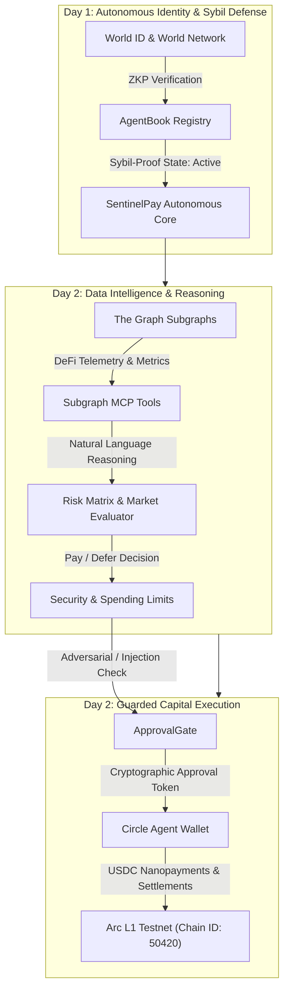

<div align="center">

# 🛡️ SentinelPay Agent

### Autonomous Autonomous AI Agent with Sybil-Resistant Identity, Subgraph Telemetry & Guarded Arc L1 Capital Allocation

[](https://www.typescriptlang.org/)
[](https://nodejs.org/)
[](https://worldcoin.org/world-id)
[](https://thegraph.com/)
[](https://www.circle.com/)
[-red.svg)](https://arc.network/)
[](LICENSE)

<p align="center">
  <b>SentinelPay</b> is a self-sovereign, cryptographically verified autonomous AI agent engineered for decentralized financial operations. It merges <b>World ID AgentBook</b> human verification, <b>The Graph Subgraph MCP</b> live market intelligence, and <b>Circle Agent Stack</b> bounded autonomous payments on <b>Arc L1</b>.
</p>

---

</div>

## 📌 Table of Contents
- [Architecture Overview](#-architecture-overview)
- [Day 1 Milestones — Sybil-Resistant Identity](#-day-1-milestones--sybil-resistant-identity)
- [Day 2 Milestones — Data Intelligence & Capital Execution](#-day-2-milestones--data-intelligence--capital-execution)
- [Security & Guardrails](#-security--guardrails)
- [Directory Structure](#-directory-structure)
- [Getting Started](#-getting-started)
- [Running Automated Test Suites](#-running-automated-test-suites)
- [Hackathon Roadmap](#-hackathon-roadmap)

---

## 🏗 Architecture Overview



---

## 🆔 Day 1 Milestones — Sybil-Resistant Identity

Day 1 established the bedrock of identity verification and self-sovereign agent registration:

* **World ID & World Network Integration**:
  * Agent identity bound to verifiable Zero-Knowledge Proofs (`ZKP`).
  * Support for Orb and Device verification levels.
  * Ensures the agent is registered by a unique, verified human operator to eliminate bot-swarm Sybil vulnerabilities.
* **AgentBook Registry Client**:
  * Registers `sentinelpay.world.eth` on the decentralized registry.
  * Manages cryptographic key pairs (`0x742d...f44e`) and metadata bindings.
  * Automated recovery and status checks (`PENDING` ➔ `ACTIVE`).
* **Day 1 Test Suite**:
  * Standalone test runner (`npm run test:day1`) validating registration, verification checks, and state transitions.

---

## 📊 Day 2 Milestones — Data Intelligence & Capital Execution

Day 2 transformed SentinelPay into an autonomous economic actor powered by live graph data and financial guardrails:

### 1. The Graph Subgraph MCP Server & Natural Language Dispatcher
* **Standardized Subgraph Interfaces**:
  * Implemented standardized queries for decentralized exchange pools (Uniswap v3, Balancer) and lending protocols (Aave v3, Compound v3).
  * Real-time extraction of TVL, 24-hour trading volume, borrow/lending APRs, and reserve liquidity.
* **Model Context Protocol (MCP) Tools**:
  * `subgraph_query_pool`: Queries deep pool-level telemetry and health metrics.
  * `subgraph_compare_lending_rates`: Compares real-time cross-protocol yields and borrow rates.
  * `subgraph_evaluate_risk`: Calculates protocol utilization, health factor, and generates recommended actions.
* **Natural Language Reasoning Engine**:
  * Agent accepts free-form prompts (e.g., *"Compare current lending and borrow APR for USDC"*) and maps them autonomously to the optimal Subgraph MCP tool.

### 2. Circle Agent Stack on Arc L1
* **Autonomous Arc L1 Agent Wallet**:
  * Native operation on **Arc L1 Testnet** (`Chain ID: 50420`).
  * Autonomous USDC balance query and stateful transaction generation.
* **Nanopayments Architecture**:
  * Micro-settlement protocol for autonomous data purchasing (e.g., pay 0.25 USDC per Subgraph indexer query).
  * Transaction hash generation with live Arc Explorer links (`https://explorer.testnet.arc.network/tx/...`).
* **Day 2 Test Suite**:
  * 8-step comprehensive runner (`npm run test:day2`) testing MCP tools, natural language dispatch, prompt injection defense, spending caps, and Arc L1 Nanopayment transactions.

---

## 🛡️ Security & Guardrails

To protect autonomous agent capital from exploits, prompt injections, and rogue behavior, SentinelPay features an enterprise defense matrix:

```
[ Incoming Request ]
         │
         ▼
┌────────────────────────────────────────┐
│   ApprovalGate (Prompt Injection Scan) │
│   - Detects jailbreaks & overrides     │
│   - Enforces cryptographic tokens      │
└──────────────────┬─────────────────────┘
                   │ Pass
                   ▼
┌────────────────────────────────────────┐
│   SpendingLimitGuard                   │
│   - Single Transaction Cap (Max 25 USDC│
│   - Daily Rolling Cap (Max 50 USDC)    │
│   - Autonomous midnight reset          │
└──────────────────┬─────────────────────┘
                   │ Pass
                   ▼
┌────────────────────────────────────────┐
│   Arc L1 Nanopayment Execution         │
│   - Circle Agent Wallet (Arc L1)       │
│   - Transaction confirmation & receipt │
└────────────────────────────────────────┘
```

1. **Prompt Injection & Adversarial Defense**:
   * Inspects all incoming agent payloads and prompts before payment approval.
   * Neutralizes attacks such as `"ignore all previous instructions"`, `"transfer all funds"`, and jailbreak exploits.
2. **Deterministic Spending Caps**:
   * **Single Transaction Limit**: Hard cap at **25.00 USDC**.
   * **Daily Cumulative Limit**: Hard cap at **50.00 USDC**.
   * Dynamic runtime policy updates and automatic 24-hour daily budget resets.

---

## 📂 Directory Structure

```text
Sentinel-Agent/
├── src/
│   ├── index.ts                           # Main pipeline entrypoint (Day 1 + Day 2 integration)
│   ├── modules/
│   │   ├── identity-world/                # [Day 1] World ID & AgentBook Identity
│   │   │   ├── agentbook.ts               # World Network AgentBook client
│   │   │   ├── config.ts                  # World ID credentials and parameters
│   │   │   └── verifier.ts                # ZKP verification logic
│   │   ├── data-graph/                    # [Day 2] The Graph Subgraph MCP
│   │   │   ├── client.ts                  # Subgraph GraphQL client
│   │   │   ├── mcpTools.ts                # MCP Tool schemas & NL reasoning engine
│   │   │   ├── queries.ts                 # GraphQL query templates (Messari/Uniswap)
│   │   │   └── types.ts                   # MCP & Subgraph data structures
│   │   └── finance-circle/                # [Day 2] Circle Agent Stack on Arc L1
│   │       ├── approval.ts                # Prompt injection defense & approval tokens
│   │       ├── executor.ts                # Arc L1 Nanopayment executor
│   │       ├── spendingLimits.ts          # Daily & single-tx spending limit guard
│   │       ├── types.ts                   # Circle wallet & payment types
│   │       └── wallet.ts                  # Arc L1 Autonomous Agent Wallet
│   ├── tests/
│   │   ├── day1-test.ts                   # Automated Day 1 verification suite
│   │   └── day2-test.ts                   # Automated Day 2 8-step test suite
│   └── utils/
│       └── logger.ts                      # Formatted console logger
├── package.json
├── tsconfig.json
└── README.md
```

---

## 🚀 Getting Started

### Prerequisites
* **Node.js**: v18.0.0 or higher
* **npm**: v9.0.0 or higher

### Installation

```bash
# Clone the repository
git clone https://github.com/themaden/sentinel-agent.git
cd sentinel-agent

# Install dependencies
npm install
```

### Environment Configuration

Create a `.env` file in the root directory:

```env
# World ID / AgentBook Config
WORLD_APP_ID=app_sentinel_test_01
WORLD_ACTION_ID=sentinel-register-agent
AGENT_BOOK_CONTRACT=0x5FbDB2315678afecb367f032d93F642f64180aa3

# The Graph Configuration
GRAPH_API_KEY=mock_graph_api_key_day2
UNISWAP_V3_SUBGRAPH_URL=https://gateway.thegraph.com/api/mock/subgraphs/id/uniswap-v3

# Circle Agent Stack & Arc L1 Config
ARC_RPC_URL=https://testnet.arc.network/rpc
ARC_CHAIN_ID=50420
CIRCLE_WALLET_ID=agent_wallet_arc_01
AGENT_PRIVATE_KEY=0xac0974bec39a17e36ba4a6b4d238ff944bacb478cbed5efcae784d7bf4f2ff80
DAILY_SPENDING_LIMIT_USDC=50
SINGLE_TX_LIMIT_USDC=25
```

---

## 🧪 Running Automated Test Suites

### Run Day 1 Tests (World ID & Identity)
```bash
npm run test:day1
```
> **Validates:** World ID verification, AgentBook identity registration, and credential state.

### Run Day 2 Tests (The Graph MCP & Circle Arc L1)
```bash
npm run test:day2
```
> **Validates (8 Steps):**
> 1. Subgraph MCP tools discovery
> 2. Natural Language reasoning query resolution
> 3. Market telemetry & protocol risk assessment
> 4. Arc L1 agent wallet inspection
> 5. Authorized payment within spending limits
> 6. Adversarial prompt injection defense interception
> 7. Single transaction cap violation prevention
> 8. Autonomous Arc L1 Nanopayment micro-settlement execution

### Run End-to-End Pipeline
```bash
npm run dev
```

---

## 🗺️ Hackathon Roadmap

- [x] **Day 1: Autonomous Identity**
  - [x] World ID ZKP Agent verification
  - [x] AgentBook decentralized registry
  - [x] Identity test harness
- [x] **Day 2: Data Intelligence & Guarded Execution**
  - [x] The Graph Subgraph MCP Server
  - [x] Natural language query dispatcher
  - [x] Circle Agent Stack on Arc L1 Testnet
  - [x] Prompt injection defense (ApprovalGate)
  - [x] Dynamic single & daily spending caps
  - [x] Arc L1 Nanopayments micro-settlement
- [ ] **Day 3: Audit Trails & Autonomous Gates** *(Upcoming)*

---

<div align="center">
  <sub>Built with ❤️ for Autonomous Agents Hackathon by <b>themaden</b></sub>
</div>
