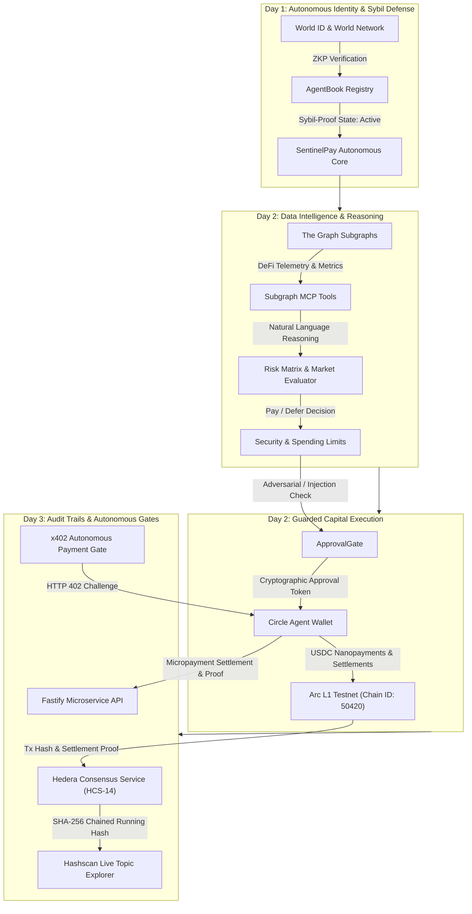

<div align="center">

# 🛡️ SentinelPay Agent

### Autonomous AI Agent with Sybil-Resistant Identity, Subgraph Telemetry, Guarded Arc L1 Capital Allocation & Hedera HCS Audit Trails

[](https://www.typescriptlang.org/)
[](https://nodejs.org/)
[](https://worldcoin.org/world-id)
[](https://thegraph.com/)
[](https://www.circle.com/)
[-red.svg)](https://arc.network/)
[](https://hedera.com/)
[](https://x402.org/)
[](https://fastify.io/)
[](LICENSE)

<p align="center">
  <b>SentinelPay</b> is a self-sovereign, cryptographically verified autonomous AI agent engineered for decentralized financial operations. It unifies <b>World ID AgentBook</b> human verification, <b>The Graph Subgraph MCP</b> live market intelligence, <b>Circle Agent Stack</b> bounded autonomous payments on <b>Arc L1</b>, and <b>Hedera Consensus Service (HCS-14)</b> immutable audit trails with <b>HTTP 402 Autonomous Gates</b>.
</p>

---

</div>

## 📌 Table of Contents
- [Architecture Overview](#-architecture-overview)
- [Day 1 Milestones — Sybil-Resistant Identity](#-day-1-milestones--sybil-resistant-identity)
- [Day 2 Milestones — Data Intelligence & Capital Execution](#-day-2-milestones--data-intelligence--capital-execution)
- [Day 3 Milestones — Audit Trails & Autonomous Gates](#-day-3-milestones--audit-trails--autonomous-gates)
- [Security & Guardrails](#-security--guardrails)
- [Directory Structure](#-directory-structure)
- [Live Cyber-Defense Web Dashboard](#-live-cyber-defense-web-dashboard)
- [Getting Started](#-getting-started)
- [Running Automated Test Suites](#-running-automated-test-suites)
- [Fastify Microservice & HTTP 402 API](#-fastify-microservice--http-402-api)
- [Deep-Dive Documentation](#-deep-dive-documentation)
- [Hackathon Roadmap](#-hackathon-roadmap)

---

## 🏗 Architecture Overview



---

## 🆔 Day 1 Milestones — Sybil-Resistant Identity

Day 1 established the bedrock of identity verification and self-sovereign agent registration:

* **World ID & World Network Integration**:
  * Agent identity bound to verifiable Zero-Knowledge Proofs (`ZKP`).
  * Support for Orb and Device verification levels.
  * Ensures the agent is registered by a unique, verified human operator to eliminate bot-swarm Sybil vulnerabilities.
* **AgentBook Registry Client**:
  * Registers `sentinelpay.world.eth` on the decentralized registry.
  * Manages cryptographic key pairs (`0x742d...f44e`) and metadata bindings.
  * Automated recovery and status checks (`PENDING` ➔ `ACTIVE`).
* **Day 1 Test Suite**:
  * Standalone test runner (`npm run test:day1`) validating registration, verification checks, and state transitions.

---

## 📊 Day 2 Milestones — Data Intelligence & Capital Execution

Day 2 transformed SentinelPay into an autonomous economic actor powered by live graph data and financial guardrails:

### 1. The Graph Subgraph MCP Server & Natural Language Dispatcher
* **Standardized Subgraph Interfaces**:
  * Implemented standardized queries for decentralized exchange pools (Uniswap v3, Balancer) and lending protocols (Aave v3, Compound v3).
  * Real-time extraction of TVL, 24-hour trading volume, borrow/lending APRs, and reserve liquidity.
* **Model Context Protocol (MCP) Tools**:
  * `subgraph_query_pool`: Queries deep pool-level telemetry and health metrics.
  * `subgraph_compare_lending_rates`: Compares real-time cross-protocol yields and borrow rates.
  * `subgraph_evaluate_risk`: Calculates protocol utilization, health factor, and generates recommended actions.
* **Natural Language Reasoning Engine**:
  * Agent accepts free-form prompts (e.g., *"Compare current lending and borrow APR for USDC"*) and maps them autonomously to the optimal Subgraph MCP tool.

### 2. Circle Agent Stack on Arc L1
* **Autonomous Arc L1 Agent Wallet**:
  * Native operation on **Arc L1 Testnet** (`Chain ID: 50420`).
  * Autonomous USDC balance query and stateful transaction generation.
* **Nanopayments Architecture**:
  * Micro-settlement protocol for autonomous data purchasing (e.g., pay 0.25 USDC per Subgraph indexer query).
  * Transaction hash generation with live Arc Explorer links (`https://explorer.testnet.arc.network/tx/...`).
* **Day 2 Test Suite**:
  * 8-step comprehensive runner (`npm run test:day2`) testing MCP tools, natural language dispatch, prompt injection defense, spending caps, and Arc L1 Nanopayment transactions.

---

## 📜 Day 3 Milestones — Audit Trails & Autonomous Gates

Day 3 establishes trustless verifiability and machine-to-machine micropayment gates:

### 1. Hedera Consensus Service (HCS-14) Universal Agent Audit Ledger
* **Immutable Cross-Chain Audit Logging**:
  * Every critical decision, World ID proof nullifier, Subgraph telemetry query, and Circle Arc L1 transaction is permanently notarized onto Hedera Consensus Service.
  * Adheres strictly to the **HCS-14 Universal Agent Audit Trail** standard specification.
* **Tamper-Evident SHA-256 Hash Chaining**:
  * Each audit message computes a running cryptographic hash incorporating sequence number, consensus timestamp, and previous hash state.
  * Continuous integrity verification prevents retroactive tampering or log alteration.
* **Live Hashscan Explorer Integration**:
  * Direct deep links generated for every transaction and topic (`https://hashscan.io/testnet/topic/...`).

### 2. HTTP 402 Payment Required Autonomous Gate Protocol (x402)
* **RFC-Compliant HTTP 402 Negotiation**:
  * Machine-to-machine paywalled endpoints challenge agents with `WWW-Authenticate: X-402 realm=... challengeId=...`.
  * Specify price, currency (`USDC` or `HBAR`), recipient address, and facilitator URL (`Blocky402 / Hedera Network`).
* **Autonomous Micropayment Settlement**:
  * Agent autonomously signs and settles micropayments (e.g., 0.10 USDC) to acquire gated telemetry feeds.
  * Generates HMAC-SHA256 cryptographic payment proofs (`X-402-Proof`).
* **Replay Attack Defense**:
  * In-memory and on-chain nonce validation ensures payment proofs can never be double-spent.

### 3. Production Fastify API Microservice
* Standalone server (`npm run server`) exposing:
  * `GET /health` — Full subsystem connectivity & status report.
  * `GET /api/agent/status` — Real-time World ID, Arc L1 wallet balance, and spending caps.
  * `GET /api/protected/market-intel` — Protected resource enforcing HTTP 402 challenge/proof releases.
  * `POST /api/x402/settle` — Agent auto-settler microservice.
  * `POST /api/audit/log` & `GET /api/audit/records` — Direct Hedera HCS submission & audit retrieval.

---

## 🛡️ Security & Guardrails

To protect autonomous agent capital from exploits, prompt injections, and rogue behavior, SentinelPay features an enterprise defense matrix:

```
[ Incoming Request ]
         │
         ▼
┌────────────────────────────────────────┐
│   ApprovalGate (Prompt Injection Scan) │
│   - Detects jailbreaks & overrides     │
│   - Enforces cryptographic tokens      │
└──────────────────┬─────────────────────┘
                   │ Pass
                   ▼
┌────────────────────────────────────────┐
│   SpendingLimitGuard                   │
│   - Single Transaction Cap (Max 25 USDC│
│   - Daily Rolling Cap (Max 50 USDC)    │
│   - Autonomous midnight reset          │
└──────────────────┬─────────────────────┘
                   │ Pass
                   ▼
┌────────────────────────────────────────┐
│   Arc L1 Nanopayment Execution         │
│   - Circle Agent Wallet (Arc L1)       │
│   - Transaction confirmation & receipt │
└──────────────────┬─────────────────────┘
                   │ Pass
                   ▼
┌────────────────────────────────────────┐
│   Hedera Consensus Service (HCS-14)    │
│   - SHA-256 Chained Running Hash       │
│   - Immutable Hashscan verification    │
└────────────────────────────────────────┘
```

1. **Prompt Injection & Adversarial Defense**:
   * Inspects all incoming agent payloads and prompts before payment approval.
   * Neutralizes attacks such as `"ignore all previous instructions"`, `"transfer all funds"`, and jailbreak exploits.
2. **Deterministic Spending Caps**:
   * **Single Transaction Limit**: Hard cap at **25.00 USDC**.
   * **Daily Cumulative Limit**: Hard cap at **50.00 USDC**.
   * Dynamic runtime policy updates and automatic 24-hour daily budget resets.
3. **Cryptographic Multi-Chain Audit Trail**:
   * World ID nullifier, Arc L1 Tx Hash, and x402 payment proof notarized on Hedera HCS.

---

## 📂 Directory Structure

```text
Sentinel-Agent/
├── .github/
│   └── workflows/
│       └── test.yml                       # Automated GitHub Actions CI (Typecheck & Tests)
├── docs/
│   ├── ARCHITECTURE.md                    # Deep-dive 4-layer architecture & system flows
│   ├── SPONSORS.md                        # Sponsor technology integration breakdowns
│   └── ETHGLOBAL_SUBMISSION.md            # Hackathon pitch, video script & submission data
├── public/
│   └── index.html                         # High-fidelity dark mode live telemetry dashboard
├── src/
│   ├── config/
│   │   └── index.ts                       # Centralized multi-chain configuration layer
│   ├── index.ts                           # Master pipeline entrypoint (Days 1, 2, and 3)
│   ├── modules/
│   │   ├── index.ts                       # Master barrel exports for all sub-ecosystems
│   │   ├── identity-world/                # [Day 1] World ID & AgentBook Identity
│   │   │   ├── index.ts                   # Module barrel export
│   │   │   ├── agentbook.ts               # World Network AgentBook client
│   │   │   ├── config.ts                  # World ID parameters
│   │   │   └── verifier.ts                # ZKP verification logic
│   │   ├── data-graph/                    # [Day 2] The Graph Subgraph MCP
│   │   │   ├── index.ts                   # Module barrel export
│   │   │   ├── client.ts                  # Subgraph GraphQL client
│   │   │   ├── mcpTools.ts                # MCP Tool schemas & NL reasoning engine
│   │   │   ├── queries.ts                 # Standardized GraphQL query templates
│   │   │   └── types.ts                   # MCP & Subgraph data structures
│   │   ├── finance-circle/                # [Day 2] Circle Agent Stack on Arc L1
│   │   │   ├── index.ts                   # Module barrel export
│   │   │   ├── approval.ts                # Prompt injection defense & approval tokens
│   │   │   ├── executor.ts                # Arc L1 Nanopayment executor
│   │   │   ├── spendingLimits.ts          # Daily & single-tx spending limit guard
│   │   │   ├── types.ts                   # Circle wallet & payment types
│   │   │   └── wallet.ts                  # Arc L1 Autonomous Agent Wallet
│   │   └── audit-hedera/                  # [Day 3] Hedera HCS-14 & x402 Autonomous Gate
│   │       ├── index.ts                   # Module barrel export
│   │       ├── client.ts                  # Hedera Hashgraph SDK client & config
│   │       ├── hcsLogger.ts               # HCS-14 universal audit trail ledger
│   │       └── x402Gate.ts                # HTTP 402 challenge & settlement protocol
│   ├── server/
│   │   └── server.ts                      # Fastify microservice API, static UI & x402 gate
│   ├── tests/
│   │   ├── day1-test.ts                   # Automated Day 1 verification suite
│   │   ├── day2-test.ts                   # Automated Day 2 8-step test suite
│   │   ├── day3-test.ts                   # Automated Day 3 7-step test suite
│   │   └── runTests.ts                    # Master unified test runner (Days 1, 2, 3)
│   └── utils/
│       └── logger.ts                      # Formatted console logger
├── package.json
├── tsconfig.json
├── .editorconfig
├── .env.example
├── LICENSE                                # MIT Open Source License
└── README.md
```

---

## 🖥️ Live Cyber-Defense Web Dashboard

SentinelPay features a built-in dark glassmorphism web dashboard for real-time monitoring and interactive testing during hackathon presentations:

```bash
# Start server & dashboard
npm run server
```
> Open your browser at `http://localhost:4000` to view:
> - **World ID Human Proof Card**: Real-time nullifier hash and verification state.
> - **The Graph Subgraph Telemetry**: Live pool TVL, borrow APR, and collateral health factor.
> - **Circle Arc L1 Capital Monitor**: Balance meter, single-tx cap, and daily limit tracking.
> - **Hedera HCS-14 Stream**: Live consensus sequence numbers with direct Hashscan links.
> - **Interactive x402 Gate Simulator**: Test autonomous HTTP 402 challenge/settlement with a single click.

---

## 🚀 Getting Started

### Prerequisites
* **Node.js**: v18.0.0 or higher
* **npm**: v9.0.0 or higher

### Installation

```bash
# Clone the repository
git clone https://github.com/themaden/sentinel-agent.git
cd sentinel-agent

# Install dependencies
npm install
```

### Environment Configuration

Create a `.env` file in the root directory:

```env
# World Network (World ID / AgentBook)
WORLD_APP_ID=app_staging_sentinelpay_world_id
WORLD_ACTION_ID=sentinelpay-agent-verification
WORLD_AGENTBOOK_ADDRESS=0x17d69280d046fB4C132E8f121d120a13Fa801827
WORLD_RPC_URL=https://worldchain-sepolia.g.alchemy.com/public

# The Graph Subgraph MCP & Gateway
THE_GRAPH_API_KEY=test_api_key
THE_GRAPH_SUBGRAPH_ID=5zvR82QoaXYFyDEKLZ9t6v9adgnptxYpKpSbxtgVENFV
THE_GRAPH_GATEWAY_URL=https://gateway.thegraph.com/api

# Circle Agent Stack on Arc L1
ARC_RPC_URL=https://rpc.testnet.arc.network
AGENT_WALLET_ADDRESS=0x742d35Cc6634C0532925a3b844Bc454e4438f44e
AGENT_PRIVATE_KEY=0x1234567890abcdef1234567890abcdef1234567890abcdef1234567890abcdef
DAILY_SPENDING_CAP_USDC=50.0

# Hedera Consensus Service & x402 Autonomous Gate
HEDERA_NETWORK=testnet
HEDERA_OPERATOR_ID=0.0.123456
HEDERA_OPERATOR_KEY=302e020100300506032b65700422042011111111111111111111111111111111
HEDERA_HCS_TOPIC_ID=0.0.987654
X402_FACILITATOR_URL=https://blocky402.hedera.testnet/pay

# Server Port
PORT=4000
```

---

## 🧪 Running Automated Test Suites

### Run All Hackathon Tests (Unified Runner)
```bash
npm test
```
> Runs Day 1, Day 2, and Day 3 sequentially and outputs a master status summary.

### Run Day 1 Tests (World ID & Identity)
```bash
npm run test:day1
```
> **Validates:** World ID verification, AgentBook identity registration, and credential state.

### Run Day 2 Tests (The Graph MCP & Circle Arc L1)
```bash
npm run test:day2
```
> **Validates (8 Steps):**
> 1. Subgraph MCP tools discovery
> 2. Natural Language reasoning query resolution
> 3. Market telemetry & protocol risk assessment
> 4. Arc L1 agent wallet inspection
> 5. Authorized payment within spending limits
> 6. Adversarial prompt injection defense interception
> 7. Single transaction cap violation prevention
> 8. Autonomous Arc L1 Nanopayment micro-settlement execution

### Run Day 3 Tests (Hedera HCS & x402 Gates)
```bash
npm run test:day3
```
> **Validates (7 Steps):**
> 1. Hedera client & HCS topic resolution
> 2. Multi-chain decision audit record notarization onto HCS
> 3. Cryptographic SHA-256 running hash chain integrity verification
> 4. Audit ledger history query & Hashscan URL generation
> 5. RFC HTTP 402 challenge creation
> 6. Autonomous micropayment settlement with replay protection
> 7. Fastify microservice HTTP 402 gate interception and authorized release

### Run End-to-End Main Pipeline
```bash
npm run dev
```

---

## 🌐 Fastify Microservice & HTTP 402 API

Start the standalone autonomous server:

```bash
npm run server
```

### Endpoints:
| Method | Endpoint | Description | Auth / Gate |
|---|---|---|---|
| `GET` | `/health` | Subsystem status (World ID, The Graph, Circle, Hedera) | Public |
| `GET` | `/api/agent/status` | Current agent address, balance, and spending caps | Public |
| `GET` | `/api/protected/market-intel` | Premium liquidity telemetry feed | **HTTP 402 (0.10 USDC)** |
| `POST` | `/api/x402/settle` | Autonomous settlement helper service | Public |
| `POST` | `/api/audit/log` | Submit decision record directly to Hedera HCS | Public |
| `GET` | `/api/audit/records` | Query recent HCS audit receipts & chain status | Public |

---

## 📚 Deep-Dive Documentation

For thorough technical explanations, architectural diagrams, and video scripts, explore our dedicated docs:

- 🏗️ [**Architecture Specification**](docs/ARCHITECTURE.md) — Complete 4-layer multi-chain sequence flows, threat modeling, and component interactions.
- 🤝 [**Sponsor Technology Integrations**](docs/SPONSORS.md) — Exact technical integration details for World ID, The Graph, Circle Arc L1, and Hedera HCS.
- 🏆 [**ETHGlobal Submission & Video Script**](docs/ETHGLOBAL_SUBMISSION.md) — Word-for-word 3-minute demo script, problem-solution pitch, and criteria checklist.

---

## 🗺️ Hackathon Roadmap

- [x] **Day 1: Autonomous Identity**
  - [x] World ID ZKP Agent verification
  - [x] AgentBook decentralized registry
  - [x] Identity test harness
- [x] **Day 2: Data Intelligence & Guarded Execution**
  - [x] The Graph Subgraph MCP Server
  - [x] Natural language query dispatcher
  - [x] Circle Agent Stack on Arc L1 Testnet
  - [x] Prompt injection defense (ApprovalGate)
  - [x] Dynamic single & daily spending caps
  - [x] Arc L1 Nanopayments micro-settlement
- [x] **Day 3: Audit Trails & Autonomous Gates**
  - [x] Hedera Consensus Service (HCS-14) Universal Agent Audit Ledger
  - [x] Cryptographic SHA-256 running hash chaining & integrity verification
  - [x] Live Hashscan topic and transaction explorer integration
  - [x] RFC-compliant HTTP 402 Payment Required Autonomous Gate protocol
  - [x] Autonomous machine-to-machine micropayment settlement
  - [x] Replay attack defense and proof verification
  - [x] Fastify microservice server implementation
  - [x] Unified end-to-end multi-chain agent lifecycle pipeline

---

<div align="center">
  <sub>Built with ❤️ for Autonomous Agents Hackathon by <b>themaden</b></sub>
</div>
