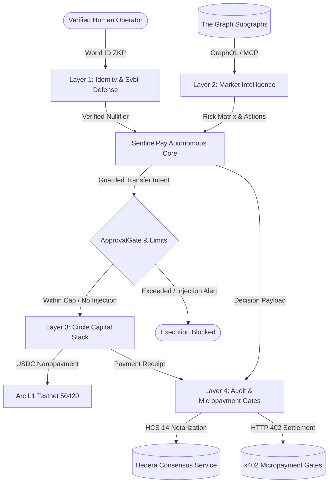

# 🛡️ SentinelPay Architecture Specification

## 1. System Overview

**SentinelPay** is an enterprise-grade autonomous AI financial agent built for cross-chain decentralized finance coordination. The architecture is segregated into 4 specialized layers:

---

## 2. Layer Specifications

### Layer 1: Identity & Sybil Defense (World Network)
- **Problem**: AI agents can be spun up in malicious bot swarms (Sybil attacks) to manipulate decentralized liquidity or exploit protocol rewards.
- **Solution**: SentinelPay binds agent wallet addresses to unique human World ID Zero-Knowledge Proofs (ZKP) through the **AgentBook** decentralized registry contract.
- **Components**:
  - `agentbook.ts`: Manages on-chain registration and CAIP-122 challenges.
  - `verifier.ts`: Evaluates ZKP nullifiers, preventing double-registration of agents by the same human.

### Layer 2: Market Intelligence (The Graph Subgraph MCP)
- **Problem**: Autonomous agents require deterministic, high-throughput on-chain telemetry without trusting centralized API oracles.
- **Solution**: SentinelPay integrates a standardized **Model Context Protocol (MCP)** server querying The Graph's decentralized Subgraphs (Uniswap v3, Balancer, Aave v3, Compound v3).
- **Components**:
  - `queries.ts`: Parameterized GraphQL queries for pools, utilization rates, and borrow/lending APRs.
  - `mcpTools.ts`: Standardized MCP tool declarations with natural language semantic query resolution.
  - `client.ts`: Market risk evaluator computing collateral health factor and recommended actions.

### Layer 3: Capital Execution & Guardrails (Circle Agent Stack on Arc L1)
- **Problem**: Autonomous wallets are vulnerable to prompt injection, unlimited drain exploits, and runaway gas consumption.
- **Solution**: SentinelPay enforces a dual-defense perimeter with deterministic single/daily spending limits and adversarial prompt screening.
- **Components**:
  - `approval.ts` (`ApprovalGate`): Regular expression and semantic scanner blocking jailbreaks, limit bypasses, and unauthorized recipient drains.
  - `spendingLimits.ts` (`SpendingLimitGuard`): Hard-capped single transaction limit (25.00 USDC) and daily rolling limit (50.00 USDC) with automatic 24-hour reset.
  - `wallet.ts` & `executor.ts`: Circle Agent Wallet operating on Arc L1 Testnet (Chain ID `50420`), producing verifiable transaction hashes and explorer links.

### Layer 4: Audit Trails & Autonomous Gates (Hedera HCS & x402)
- **Problem**: Autonomous machine actions require tamper-evident, third-party auditability and the ability to autonomously pay for paywalled machine-to-machine APIs.
- **Solution**: Every agent decision is notarized onto Hedera Consensus Service using the **HCS-14 Universal Agent Audit Trail** standard, while incoming/outgoing premium services are gated by **RFC HTTP 402 Payment Required** protocols.
- **Components**:
  - `hcsLogger.ts`: Computes sequential SHA-256 running hashes chaining sequence numbers, consensus timestamps, and previous states.
  - `x402Gate.ts`: Issues RFC-compliant HTTP 402 challenges and autonomously signs settlement proofs.
  - `server.ts`: Fastify microservice providing endpoints for health checks, live telemetry, and protected resource gating.

---

## 3. Cryptographic Multi-Chain Traceability

Each autonomous cycle creates an immutable link across 4 distinct decentralized networks:

| Network | Entity | Role | Identifier Format |
|---|---|---|---|
| **World Chain** | World ID | Sybil Proof of Personhood | `0x776f726c642d...` (Nullifier Hash) |
| **The Graph** | Subgraphs | Market Telemetry Source | `0x88e6a0c2ddd2...` (Pool Address) |
| **Arc L1** | Circle USDC | Capital Settlement | `0x68fc9a087e13...` (Arc L1 Tx Hash) |
| **Hedera** | HCS Topic | Immutable Audit Trail | `0.0.987654` (Topic) + `#1003` (Sequence) |
